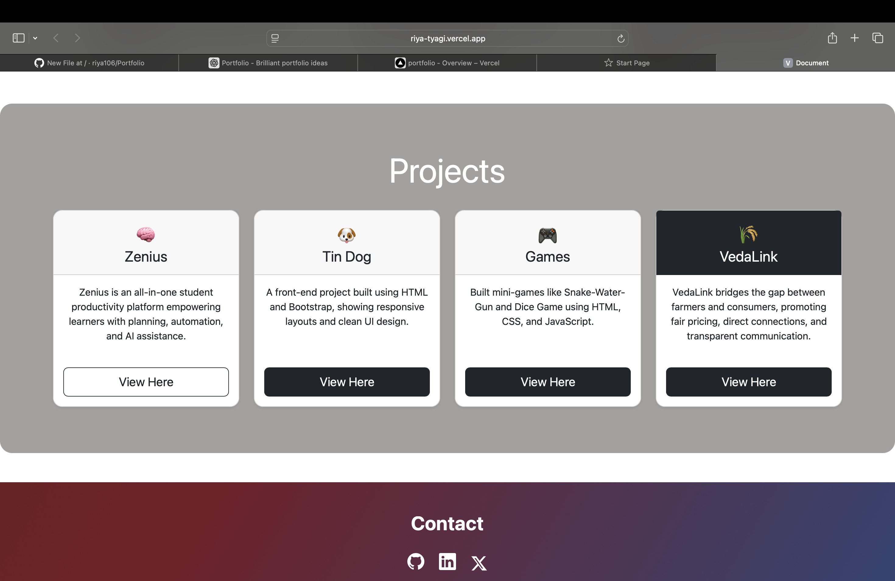

## Riya Tyagi — Portfolio
Welcome to my personal portfolio!
This project showcases my skills, projects, achievements, and journey as a Full-Stack Developer and AI/ML Learner.

##About Me
Hi! I’m Riya Tyagi, a passionate developer who loves building clean, modern and user-centric web applications.
I’m currently strengthening my skills in:
Full Stack Development
React, JavaScript, Bootstrap
AI / ML Concepts
UI/UX Tools — Canva, Figma
Problem Solving & Logic Building

###Projects Included
🔹 Zenius
A student productivity platform that organizes internships, plans, and learning resources with AI-powered features.
🔹 TinDog Website
A fun front-end project created using HTML & Bootstrap, showcasing responsive design concepts.
🔹 Games Collection
Mini games like Snake-Water-Gun and Dice Game built using HTML, CSS & JavaScript.
🔹 VedaLink
A platform connecting farmers and consumers, promoting fairness, transparency, and easy communication.
🛠️ Tech Stack
Languages: HTML, CSS, JavaScript
Frameworks: Bootstrap
Tools: GitHub, Figma, Canva
Learning: AI/ML, Automation

📌 Features of This Portfolio
✔ Modern UI with animated gradient background
✔ Typing effect header
✔ Responsive & mobile-friendly
✔ Project cards with buttons
✔ Clean footer with social links
🔗 Live Portfolio
Once deployed, your GitHub Pages link will appear here:
👉 🌟 Riya Tyagi — Portfolio
Welcome to my personal portfolio!
This project showcases my skills, projects, achievements, and journey as a Full-Stack Developer and AI/ML Learner.
🚀 About Me
Hi! I’m Riya Tyagi, a passionate developer who loves building clean, modern and user-centric web applications.
I’m currently strengthening my skills in:
Full Stack Development
React, JavaScript, Bootstrap
AI / ML Concepts
UI/UX Tools — Canva, Figma
Problem Solving & Logic Building
💼 Projects Included
🔹 Zenius
A student productivity platform that organizes internships, plans, and learning resources with AI-powered features.
🔹 TinDog Website
A fun front-end project created using HTML & Bootstrap, showcasing responsive design concepts.
🔹 Games Collection
Mini games like Snake-Water-Gun and Dice Game built using HTML, CSS & JavaScript.
🔹 VedaLink
A platform connecting farmers and consumers, promoting fairness, transparency, and easy communication.
🛠️ Tech Stack
Languages: HTML, CSS, JavaScript
Frameworks: Bootstrap
Tools: GitHub, Figma, Canva
Learning: AI/ML, Automation

📌 Features of This Portfolio
✔ Modern UI with animated gradient background
✔ Typing effect header
✔ Responsive & mobile-friendly
✔ Project cards with buttons
✔ Clean footer with social links

🔗 Live Portfolio
Once deployed, your GitHub Pages link will appear here:
👉 https://riya106.github.io/Portfolio/
